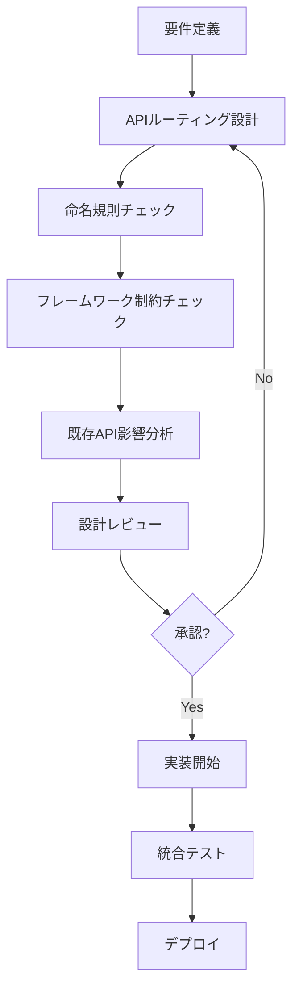
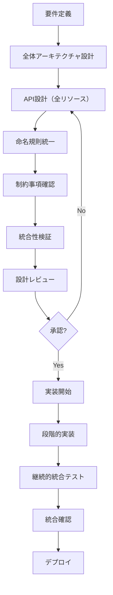

# 🎯 **システム設計フィードバック - 設計段階考慮項目**

**Issue ID**: `20250728_system_design_feedback`  
**作成日時**: 2025年7月28日  
**ステータス**: 🔲 **TODO** - 今後の設計改善指針  
**優先度**: 🔴 **High** - 次期プロジェクトから適用  

---

## 📋 **背景・目的**

### **発端**
Ginルーターパスパラメータ競合エラー（`20250728_fix_conflict_path_parameter`）の発生により、**設計段階での考慮不足**が根本原因として浮き彫りになった。

### **目的**
今回の問題を踏まえ、**将来のシステム設計で事前に考慮すべき項目**を体系化し、同様問題の再発防止を図る。

### **適用対象**
- 新規APIプロジェクト設計
- 既存システムの機能拡張設計
- マイクロサービス間API設計
- レガシーシステムのリファクタリング設計

---

## 🏗️ **設計段階考慮項目**

### **1. 🛣️ APIルーティング設計**

#### **❌ 今回の問題点**
```go
// 個別実装による非統一設計
User API:     /api/v1/users/:id           // ✅ 正しい
UserRole API: /api/v1/users/:user_id/roles // ❌ 異なるパラメータ名
```

#### **✅ 今後の改善策**

**1.1 ルーティング全体設計の事前策定**
```yaml
# docs/design/api-routing-master-plan.yml
api_design:
  version: "v1"
  base_path: "/api/v1"
  
resource_hierarchy:
  users:
    base: "/users"
    parameters: 
      primary_key: ":id"  # 必ず :id で統一
    nested_resources:
      - path: "/:id/roles"
        description: "ユーザーロール管理"
      - path: "/:id/permissions"  
        description: "ユーザー権限管理"
      - path: "/:id/departments"
        description: "ユーザー部署履歴"
  
  departments:
    base: "/departments"
    parameters:
      primary_key: ":id"
    nested_resources:
      - path: "/:id/users"
        description: "部署所属ユーザー"
      - path: "/:id/hierarchy"
        description: "部署階層"

naming_conventions:
  primary_key: ":id"                    # 主キーは常に :id
  foreign_key: ":parent_id, :role_id"   # 外部キーは :resource_id 形式
  query_params: "page, limit, search"   # ページング・検索は統一
```

**1.2 フレームワーク制約の事前調査**
```markdown
## フレームワーク制約調査チェックリスト

### Gin Router制約
- [ ] 同一階層での異なるワイルドカード名制約確認
- [ ] パスパラメータ競合パターン把握
- [ ] ルーティング優先順位ルール理解
- [ ] 正規表現制約の制限事項確認

### 技術スタック制約
- [ ] ORM（GORM）のリレーション制約
- [ ] JWT クレーム設計制約  
- [ ] ミドルウェアチェーン制約
- [ ] データベーススキーマ制約
```

**1.3 API設計レビューフロー**


---

### **2. 📏 命名規則・コーディング規約**

#### **❌ 今回の問題点**
- パラメータ命名の**非統一**（`:id` vs `:user_id`）
- 命名規則の**ドキュメント化不足**
- レビュー時の**チェック項目未定義**

#### **✅ 今後の改善策**

**2.1 包括的命名規則策定**
```yaml
# docs/standards/naming-conventions.yml
api_naming:
  path_parameters:
    resource_id: ":id"              # リソース主キー
    parent_id: ":parent_id"         # 親リソース参照
    relation_id: ":role_id, :permission_id"  # 関連リソース
  
  query_parameters:
    pagination: "page, limit"       # ページング
    filtering: "status, type"       # フィルタリング
    searching: "search, q"          # 検索
    sorting: "sort, order"          # ソート
  
  response_format:
    collection: "data, pagination, meta"
    single_resource: "data"
    error: "code, message, details"

database_naming:
  tables: "snake_case (users, user_roles)"
  columns: "snake_case (created_at, user_id)"
  indexes: "idx_table_column"
  foreign_keys: "fk_table_reference"

go_naming:
  packages: "lowercase (handlers, services)"
  structs: "PascalCase (UserService, DepartmentHandler)"
  functions: "PascalCase (GetUser, CreateDepartment)"
  variables: "camelCase (userID, departmentList)"
  constants: "UPPER_SNAKE_CASE (DEFAULT_PAGE_SIZE)"
```

**2.2 自動化された命名規則チェック**
```go
// tools/naming-checker/main.go
type NamingChecker struct {
    rules map[string][]string
}

func (nc *NamingChecker) CheckAPIRoutes(routes []Route) []Violation {
    violations := []Violation{}
    
    for _, route := range routes {
        // パラメータ命名チェック
        if params := extractParameters(route.Path); len(params) > 0 {
            for _, param := range params {
                if !nc.isValidParameterName(param) {
                    violations = append(violations, Violation{
                        Type: "InvalidParameterName",
                        Route: route.Path,
                        Parameter: param,
                        Suggestion: nc.suggestCorrectName(param),
                    })
                }
            }
        }
        
        // パス構造チェック
        if !nc.isValidPathStructure(route.Path) {
            violations = append(violations, Violation{
                Type: "InvalidPathStructure", 
                Route: route.Path,
                Suggestion: "Follow RESTful naming conventions",
            })
        }
    }
    
    return violations
}
```

---

### **3. 🔧 技術アーキテクチャ設計**

#### **❌ 今回の問題点**
- **段階的実装**による統合テスト不足
- **フレームワーク制約理解**の不備
- **全体設計**の統合性検証不足

#### **✅ 今後の改善策**

**3.1 アーキテクチャ決定記録（ADR）**
```markdown
# docs/architecture/ADR-001-api-routing-strategy.md

## ステータス
承認済み

## コンテキスト
RESTful APIの設計において、複数リソース間の関連性を表現する方法を決定する必要がある。

## 決定事項
- 主キーパラメータは全API統一で `:id` を使用
- ネストしたリソースは `/parent/:id/child` 形式
- フレームワーク制約を事前調査・文書化

## 結果
- API一貫性の向上
- 開発者の混乱回避
- フレームワーク制約による実装エラー予防

## 実装ガイドライン
```go
// ✅ 推奨パターン
GET    /api/v1/users/:id
GET    /api/v1/users/:id/roles
PATCH  /api/v1/users/:id/roles/:role_id

// ❌ 避けるべきパターン  
GET    /api/v1/users/:user_id      // 異なるパラメータ名
GET    /api/v1/user-roles/:id      // 別パス（RESTful違反）
```
```

**3.2 技術制約マトリックス**
```yaml
# docs/architecture/technical-constraints.yml
framework_constraints:
  gin_router:
    wildcard_conflicts:
      description: "同一階層で異なるワイルドカード名使用不可"
      example_error: "':user_id' conflicts with ':id'"
      prevention: "パラメータ名統一（:id）"
      
    route_priority:
      description: "静的パス > パラメータパス > ワイルドカード"
      example: "/users/search > /users/:id > /users/*action"
      
    middleware_chain:
      description: "ミドルウェア実行順序制約"
      order: "CORS → Auth → Permission → Handler"

database_constraints:
  gorm:
    association_naming:
      description: "関連テーブル命名規則"
      convention: "user_roles, role_permissions"
      
    foreign_key_constraints:
      description: "外部キー制約設定"
      required: "ON DELETE CASCADE 設定必須"

deployment_constraints:
  docker:
    port_binding: "8080:8080"
    environment: "必須環境変数定義"
    
  database:
    migration_strategy: "Up/Down両方実装必須"
    seed_data: "開発・テスト環境用データ準備"
```

---

### **4. 🧪 テスト戦略設計**

#### **❌ 今回の問題点**
- **統合テスト**での早期発見不足
- **サーバー起動テスト**の自動化不足
- **段階的実装**時の統合性確認不足

#### **✅ 今後の改善策**

**4.1 多層テスト戦略**
```yaml
# docs/testing/test-strategy.yml
test_pyramid:
  unit_tests:
    coverage_target: "90%+"
    scope: "個別メソッド・関数"
    tools: "testify, gomock"
    
  integration_tests:
    coverage_target: "80%+"
    scope: "API統合・データベース連携"
    tools: "httptest, testcontainers"
    
  e2e_tests:
    coverage_target: "主要フロー100%"
    scope: "ユーザーシナリオ"
    tools: "API Demo Scripts"

routing_specific_tests:
  server_startup:
    description: "全ルート登録確認"
    automated: true
    frequency: "コミット毎"
    
  route_conflicts:
    description: "ルーティング競合検出"
    automated: true
    frequency: "コミット毎"
    
  parameter_consistency:
    description: "パラメータ命名統一確認"
    automated: true
    frequency: "コミット毎"
```

**4.2 継続的統合テスト**
```go
// tests/integration/routing_integration_test.go
func TestSystemIntegration(t *testing.T) {
    // サーバー起動テスト（パニック検出）
    t.Run("ServerStartup", func(t *testing.T) {
        server := setupTestServer()
        defer server.Close()
        assert.NotNil(t, server)
    })
    
    // ルーティング整合性テスト
    t.Run("RouteConsistency", func(t *testing.T) {
        router := setupTestRouter()
        routes := extractRoutes(router)
        
        violations := checkNamingConsistency(routes)
        assert.Empty(t, violations, "Naming convention violations found")
        
        conflicts := checkRouteConflicts(routes)
        assert.Empty(t, conflicts, "Route conflicts detected")
    })
    
    // API統合フローテスト
    t.Run("APIFlow", func(t *testing.T) {
        // 認証 → ユーザー作成 → ロール割り当て → 権限確認
        token := performLogin(t)
        userID := createUser(t, token)
        assignRole(t, token, userID, "admin")
        verifyPermissions(t, token, userID)
    })
}
```

---

### **5. 📚 ドキュメント戦略**

#### **❌ 今回の問題点**
- **API設計書**の統合性記載不足
- **制約事項**のドキュメント化不足
- **レビューガイド**の具体性不足

#### **✅ 今後の改善策**

**5.1 Living Documentation**
```yaml
# docs/documentation-strategy.yml
documentation_layers:
  architecture:
    files: 
      - "architecture/system-overview.md"
      - "architecture/api-design-principles.md"
      - "architecture/technical-constraints.md"
    update_trigger: "設計変更時"
    
  api_specification:
    files:
      - "api/openapi.yaml"
      - "api/routing-master-plan.yml"
      - "api/parameter-naming-guide.md"
    update_trigger: "API変更時"
    
  development_guides:
    files:
      - "development/coding-standards.md"
      - "development/review-checklist.md"
      - "development/testing-guidelines.md"
    update_trigger: "プロセス改善時"

automation:
  api_docs_generation:
    source: "OpenAPI Spec"
    output: "docs/api.html"
    frequency: "自動（コミット時）"
    
  constraint_validation:
    source: "コード解析"
    output: "violation-report.md"
    frequency: "CI/CD パイプライン"
```

**5.2 設計レビューガイド**
```markdown
# docs/development/design-review-guide.md

## API設計レビューチェックリスト

### 🛣️ ルーティング設計
- [ ] パラメータ命名規則準拠（:id 統一）
- [ ] RESTful設計原則に沿ったURL構造
- [ ] 既存APIとの整合性確認
- [ ] フレームワーク制約への適合

### 🏗️ アーキテクチャ整合性
- [ ] 全体設計との統合性
- [ ] 技術制約の考慮
- [ ] パフォーマンス影響分析
- [ ] セキュリティ考慮事項

### 🧪 テスト戦略
- [ ] 単体テスト計画
- [ ] 統合テスト範囲
- [ ] E2Eテストシナリオ
- [ ] 継続的テスト自動化

### 📚 ドキュメント
- [ ] API仕様書更新
- [ ] アーキテクチャ決定記録
- [ ] 制約事項文書化
- [ ] 運用ドキュメント更新
```

---

### **6. 🔄 開発プロセス改善**

#### **❌ 今回の問題点**
- **段階的実装**による**統合確認不足**
- **設計レビュー**の**形式的実行**
- **早期検証**システムの**未整備**

#### **✅ 今後の改善策**

**6.1 設計ファーストアプローチ**


**6.2 継続的検証システム**
```bash
# .github/workflows/design-validation.yml
name: Design Validation

on: [push, pull_request]

jobs:
  routing-validation:
    runs-on: ubuntu-latest
    steps:
      - uses: actions/checkout@v2
      
      - name: Setup Go
        uses: actions/setup-go@v2
        with:
          go-version: 1.21
          
      - name: Validate API Routes
        run: |
          go run tools/route-validator/main.go
          
      - name: Check Naming Conventions  
        run: |
          go run tools/naming-checker/main.go
          
      - name: Server Startup Test
        run: |
          timeout 30s make run-docker-env > /dev/null 2>&1 || exit 1
          
      - name: Integration Test
        run: |
          make test-integration
```

---

## 🎯 **優先実装項目**

### **🔴 Critical（即座実装）**
1. **APIルーティング全体設計書作成**
   - 期限: 1週間以内
   - 担当: システムアーキテクト
   - 成果物: `docs/design/api-routing-master-plan.yml`

2. **命名規則統一ガイドライン策定**
   - 期限: 1週間以内  
   - 担当: 開発チームリード
   - 成果物: `docs/standards/naming-conventions.yml`

3. **継続的統合テスト実装**
   - 期限: 2週間以内
   - 担当: DevOpsエンジニア
   - 成果物: サーバー起動・ルーティング整合性自動テスト

### **🟡 High（1ヶ月以内）**
4. **アーキテクチャ決定記録（ADR）整備**
5. **技術制約マトリックス作成**
6. **設計レビューチェックリスト策定**

### **🟢 Medium（3ヶ月以内）**
7. **自動化ツール開発**（命名規則チェッカー等）
8. **Living Documentation システム構築**
9. **開発者トレーニングプログラム実施**

---

## 📊 **期待効果**

### **短期効果（1-3ヶ月）**
- ✅ ルーティング競合エラー**100%予防**
- ✅ API設計の**一貫性向上**
- ✅ 設計レビューの**品質向上**
- ✅ 統合テストでの**早期問題発見**

### **中期効果（3-6ヶ月）**
- ✅ 開発速度の**20%向上**（設計手戻り削減）
- ✅ バグ検出工数の**30%削減**（自動化による）
- ✅ 新規メンバーの**学習コスト50%削減**（標準化による）

### **長期効果（6ヶ月以上）**
- ✅ システム保守性の**大幅向上**
- ✅ 技術的負債の**継続的削減**
- ✅ チーム全体の**設計スキル向上**

---

## 🚀 **実装ロードマップ**

### **Phase 1: 基盤整備（1ヶ月）**
```yaml
week_1:
  - APIルーティング全体設計書作成
  - 命名規則ガイドライン策定
  
week_2-3:
  - 継続的統合テスト実装
  - ADR テンプレート・初期記録作成
  
week_4:
  - 設計レビューチェックリスト策定
  - 技術制約マトリックス作成
```

### **Phase 2: 自動化（2ヶ月目）**
```yaml
week_5-6:
  - 命名規則チェックツール開発
  - ルーティング競合検出ツール開発
  
week_7-8:
  - CI/CD パイプライン統合
  - 自動化テスト強化
```

### **Phase 3: 標準化（3ヶ月目）**
```yaml
week_9-10:
  - Living Documentation システム構築
  - 開発者トレーニング実施
  
week_11-12:
  - 運用開始・フィードバック収集
  - 継続的改善プロセス確立
```

---

## 📋 **成功指標（KPI）**

### **品質指標**
- **ルーティング関連エラー発生数**: 0件/月
- **設計手戻り回数**: 80%削減
- **API一貫性スコア**: 95%以上

### **効率指標**  
- **設計レビュー時間**: 30%短縮
- **統合テスト実行時間**: 50%短縮
- **新機能開発速度**: 20%向上

### **品質指標**
- **開発者満足度**: 4.5/5.0以上
- **ドキュメント利用率**: 90%以上
- **標準遵守率**: 95%以上

---

## ✅ **実装完了チェックリスト**

### **ドキュメント整備**
- [ ] `docs/design/api-routing-master-plan.yml`
- [ ] `docs/standards/naming-conventions.yml`
- [ ] `docs/architecture/technical-constraints.yml`
- [ ] `docs/development/design-review-guide.md`

### **自動化ツール**
- [ ] ルーティング競合検出ツール
- [ ] 命名規則チェックツール
- [ ] 継続的統合テスト
- [ ] CI/CD パイプライン統合

### **プロセス改善**
- [ ] 設計ファーストアプローチ導入
- [ ] アーキテクチャ決定記録（ADR）運用
- [ ] 設計レビューチェックリスト運用
- [ ] 継続的改善プロセス確立

---

**🎯 このフィードバックドキュメントの実装により、今後のシステム設計で同様の問題を予防し、より堅牢で保守性の高いシステムアーキテクチャを実現できます。**
