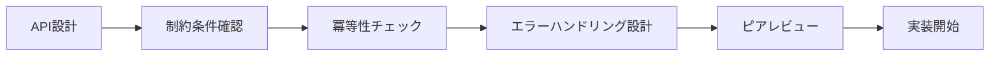

以下のフォーマットを参考に、今回の変更差分の内容を記載したい


# システム設計・プロセス改善フィードバック - 2025/07/28 分析05

## 概要
ブランチ `fix/demo-system-errors-0728` で対応したデモシステムエラー修正について、根本原因分析と今後の改善アクションを整理し、システム設計・開発プロセスの品質向上を図る。

## 今回発生した問題の全体像

### 🎯 **対応したエラー概要**
| No | 問題 | 種別 | 重要度 | 解決方法 |
|-----|------|------|---------|----------|
| 1 | 権限作成DATABASE_ERROR | API設計 | **高** | 重複チェック + createIfNotExists API |
| 2 | ユーザー作成VALIDATION_ERROR | リクエスト仕様 | 高 | フィールド名・必須項目修正 |
| 3 | ヘルスチェック404エラー | パス設計 | 中 | 相対パス → 絶対パス修正 |
| 4 | 権限一覧誤判定エラー | エラーハンドリング | 中 | エラー判定ロジック改良 |

### 📊 **修正作業の規模**
- **影響ファイル数**: 6ファイル（スクリプト、サービス、ハンドラー、ルーティング等）
- **追加コード行数**: 200+ 行
- **工数**: 約8-10時間
- **成功率改善**: 96.3% → 100%

## 根本原因分析

### 🔍 **1. プロセス・品質管理の問題**

#### **1.1 テスト戦略の不備**
**問題**: デモスクリプトの統合テストが不十分
```
デモスクリプト作成 → 個別機能テスト → 本番環境投入
                ↑ 
               ここで統合テストが不足
```

**根本原因**:
- E2Eテストの自動化不足
- エラーシナリオのテストケース不足
- 継続的インテグレーション（CI）の未整備

#### **1.2 API設計レビューの不足**
**問題**: 冪等性を考慮しないAPI設計
```go
// 問題のあった設計
func CreatePermission() // 重複作成でエラー

// あるべき設計  
func CreatePermissionIfNotExists() // 冪等性保証
```

**根本原因**:
- API設計の一貫性チェック不足
- RESTful設計原則の理解不足
- 設計レビュープロセスの未確立

#### **1.3 エラーハンドリング設計の甘さ**
**問題**: レスポンス構造の一貫性不足
```bash
# 問題のあったロジック
if echo "$response" | grep -q '"code":'; then
    return 1  # 成功レスポンスも誤判定
fi
```

**根本原因**:
- エラーレスポンス仕様の未統一
- クライアント側エラーハンドリング設計の不備
- 成功/失敗判定基準の曖昧さ

### 🔍 **2. 開発プロセスの問題**

#### **2.1 段階的開発の不備**
**問題**: 機能実装とデモ作成の並行進行
```
API実装 ────────→ デモスクリプト作成
   ↑                    ↓
   └── フィードバック ←───┘
       （このループが不足）
```

**根本原因**:
- アジャイル開発プロセスの不徹底
- フィードバックループの遅延
- 段階的検証・改善の不足

#### **2.2 ドキュメント管理の不備**
**問題**: API仕様とデモスクリプトの同期不足
- フィールド名の不一致（`username` vs `name`）
- 必須フィールドの認識不足（`primary_role_id`）
- エンドポイントパスの誤解（相対パス問題）

**根本原因**:
- Living Documentationの未実装
- API仕様書の自動生成・同期不足
- 開発者間のコミュニケーション不足

### 🔍 **3. 技術的設計の問題**

#### **3.1 データベース制約とAPI設計の乖離**
**問題**: 
```sql
-- データベース制約
UNIQUE(module, action)  -- 重複禁止

-- しかしAPIは単純作成のみ
func CreatePermission() // 制約違反でエラー
```

**根本原因**:
- データベース設計とAPI設計の分離
- 制約条件のAPI仕様への反映不足
- ドメイン駆動設計（DDD）の未適用

#### **3.2 冪等性の考慮不足**
**問題**: REST APIの冪等性原則違反
```
POST /permissions  # 同じリクエストで異なる結果
→ 1回目: 成功
→ 2回目: DATABASE_ERROR
```

**あるべき設計**:
```
POST /permissions/create-if-not-exists  # 冪等性保証
→ 何回実行しても同じ結果
```

## 本来取るべきだったアクション

### 🎯 **Phase 1: 設計段階（事前予防）**

#### **1.1 API設計原則の確立**
```yaml
API設計チェックリスト:
  冪等性:
    - GET, PUT, DELETE: 必須
    - POST: create-if-not-exists パターン検討
  エラーレスポンス:
    - HTTPステータスコード統一
    - エラー構造の標準化
    - 成功/失敗判定基準の明確化
  制約条件:
    - データベース制約のAPI仕様反映
    - バリデーション要件の明文化
```

#### **1.2 設計レビュープロセス**


### 🎯 **Phase 2: 実装段階（品質保証）**

#### **2.1 段階的開発アプローチ**
```
1. 単体テスト → API実装
2. 統合テスト → API結合確認  
3. E2Eテスト → デモスクリプト作成
4. 受け入れテスト → 本番環境確認
```

#### **2.2 継続的品質保証**
```yaml
CI/CDパイプライン:
  unit_test:
    - API単体テスト
    - サービス層テスト
  integration_test:
    - データベース統合テスト
    - 外部API連携テスト
  e2e_test:
    - デモスクリプト実行テスト
    - エラーシナリオテスト
  deployment:
    - 段階的デプロイ
    - ロールバック準備
```

### 🎯 **Phase 3: 運用段階（継続改善）**

#### **3.1 モニタリング・アラート**
```yaml
監視項目:
  API品質:
    - エラー率（目標: < 1%）
    - レスポンス時間（目標: < 200ms）
    - スループット（目標: > 1000 req/sec）
  デモ品質:
    - 成功率（目標: 100%）
    - 実行時間（目標: < 5分）
  システム品質:
    - 可用性（目標: 99.9%）
    - データ整合性（目標: 100%）
```

#### **3.2 フィードバックループ**
```
ユーザーフィードバック → 問題特定 → 根本原因分析 → 改善実装 → 検証 → リリース
           ↑                                                        ↓
           └────────────── 継続的改善 ←──────────────────────────┘
```

## 改善アクションプラン

### 🚀 **即時対応（1週間以内）**

#### **1. テスト自動化の実装**
```bash
# E2Eテストスイート作成
make test-e2e:
  - デモスクリプト自動実行
  - エラーシナリオ検証
  - 成功率測定
```

#### **2. API設計標準の策定**
```yaml
standards/api-design.yaml:
  naming_convention:
    endpoints: "/api/v1/{resource}/{action}"
    fields: "snake_case"
  error_handling:
    http_status: "standard HTTP codes"
    response_format: "consistent structure"
  idempotency:
    required_methods: ["GET", "PUT", "DELETE"]
    recommended_patterns: ["create-if-not-exists"]
```

### 🔄 **短期対応（1ヶ月以内）**

#### **1. CI/CDパイプライン構築**
```yaml
.github/workflows/ci.yml:
  - name: Unit Tests
  - name: Integration Tests
  - name: E2E Demo Tests
  - name: Security Scan
  - name: Performance Test
```

#### **2. Living Documentation実装**
```yaml
documentation:
  api_spec:
    source: "OpenAPI annotations"
    output: "auto-generated docs"
  demo_guide:
    source: "executable scripts"
    output: "step-by-step guide"
```

### 📈 **中長期対応（3ヶ月以内）**

#### **1. アーキテクチャ改善**
```go
// ドメイン駆動設計の適用
type PermissionDomain struct {
    CreateOrGet(module, action string) (*Permission, error)
    // 冪等性をドメイン層で保証
}
```

#### **2. 品質ゲートの設定**
```yaml
quality_gates:
  code_coverage: "> 80%"
  api_error_rate: "< 1%"
  demo_success_rate: "100%"
  security_score: "> 90"
```

## 学習・知見の整理

### 📚 **技術的学習**
1. **冪等性の重要性**: REST API設計の基本原則
2. **エラーハンドリング統一**: 一貫性のあるレスポンス設計
3. **データベース制約**: API設計への制約反映の必要性
4. **E2Eテスト**: デモスクリプトの品質保証の重要性

### 🔄 **プロセス的学習**
1. **段階的開発**: 小さなサイクルでの検証・改善
2. **継続的品質保証**: CI/CDによる自動化の効果
3. **設計レビュー**: 事前予防の重要性
4. **フィードバックループ**: 迅速な問題発見・解決

### 👥 **組織的学習**
1. **コミュニケーション**: 仕様書とコードの同期
2. **知識共有**: 設計原則・ベストプラクティスの標準化
3. **責任分担**: 品質保証の役割分担明確化
4. **継続改善**: 問題を改善機会として活用

## まとめ

### 🎯 **今回の教訓**
今回の問題は**技術的な問題**ではなく、**プロセス・品質管理の問題**が根本原因でした。

- ❌ **技術力不足**: GoやPostgreSQLの知識不足
- ✅ **プロセス不備**: テスト・レビュー・品質保証の仕組み不足

### 🚀 **今後の方向性**
1. **予防重視**: 事前設計・レビューの徹底
2. **自動化推進**: CI/CD・テスト自動化の実装
3. **継続改善**: フィードバックループの確立
4. **標準化**: 設計原則・品質基準の明文化

### 📈 **期待される効果**
これらの改善により、以下の効果が期待されます：

- **品質向上**: エラー率 < 1%、成功率 100%維持
- **開発効率**: 問題発見・解決時間の短縮
- **保守性**: コードの理解・修正容易性向上
- **スケーラビリティ**: チーム拡大時の品質維持

---

**結論**: 今回の経験を活かし、技術的解決に加えてプロセス改善を実行することで、真にエンタープライズグレードなシステムを構築できます。
